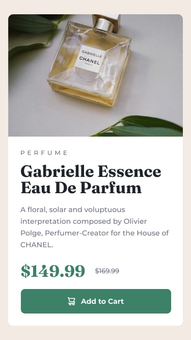

# Responsive Product preview card component

## Welcome! 👋

Thanks for checking out this Project!

## Description:

- The challenge is to build a Responsive-Product-Preview-Card-Component and to get it looking as close to the figma-designs as possible.

- Tools for this challenge:-
    
    - VS Code (for IDE)
    - HTML    (for Lang used)
    - CSS

- Users can:-
  
    - View the optimal layout depending on their device's screen size.
    - See hover and focus states for interactive elements
  
## Styles Used:

- Colors

    - Primary

        - Dark cyan: hsl(158, 36%, 37%)
        - Cream: hsl(30, 38%, 92%)

    - Neutral

        - Very dark blue: hsl(212, 21%, 14%)
        - Dark grayish blue: hsl(228, 12%, 48%)
        - White: hsl(0, 0%, 100%)
  
- Font

    - Family: [Montserrat](https://fonts.google.com/specimen/Montserrat)
    - Weights: 500, 700

    - Family: [Fraunces](https://fonts.google.com/specimen/Fraunces)
    - Weights: 700

## Got feedback!

This project is open for any kind of constructive criticism and feedback! I always looks to improve my work and knowledge. So if you have anything you'd like to mention or you want to ask something, please email Hi! [at] Shivamchtaurvedi268@gmail.com.

Raise any productive or improved merge requests, by pulling the source code it's open source.

**Have Fun Coding!** 😎😁